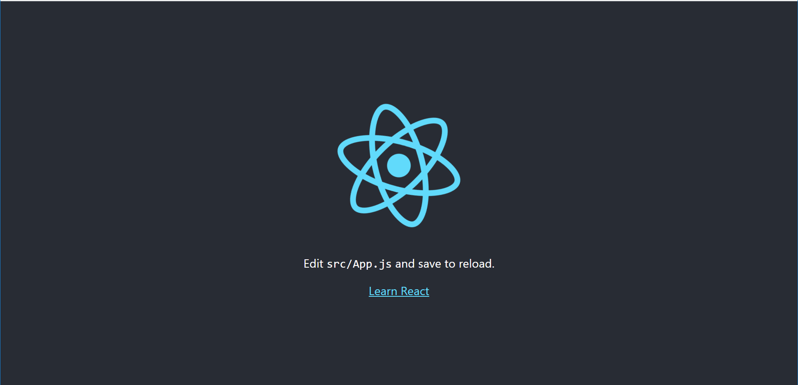

# Gitflow firts steps

## Create development branch
~~~~
$ git checkout -b development
~~~~

**Be sure you are on it**
~~~~
$ git branch
~~~~

**The output must be:**
~~~~
* development
~~~~

## Init repo as npm package

- Init as npm package (hit enter in everything for the moment):

~~~~
$ npm init
~~~~

- Add package.json to be tracking by git:
~~~~
$ git add package.json
$ git commit -m "Added the firts version of package.json"
$ git push --set-upstream origin development
~~~~

- Step two install create-react-app to create an react app too fast
~~~~
$ npm install --save-dev create-react-app
~~~~

- create a react basic project

~~~~
$ npx create-react-app gitflow-example
~~~~

- Adding changes of package.json with packe to see what changes
~~~~
$ git add -p
~~~~

Select the changes you want to commit and type "y" (only the create-react-app as devDependency must exists to add)
Like this:

~~~~
@@ -16,7 +16,8 @@
     "url": "https://github.com/${username}/gitflow-example-project/issues"
   },
   "homepage": "https://github.com/${username}/gitflow-example-project#readme",
-  "dependencies": {
+  "dependencies": {},
+  "devDependencies": {
     "create-react-app": "^3.0.1"
   }
 }
Stage this hunk [y,n,q,a,d,e,?]?
~~~~

- Add the not tracking files, must be the following if you do "git status":
~~~~
$ git status
On branch development
Your branch is up to date with 'origin/development'.

Changes to be committed:
  (use "git reset HEAD <file>..." to unstage)

        modified:   package.json

Untracked files:
  (use "git add <file>..." to include in what will be committed)

        gitflow-example/
        package-lock.json
~~~~

It means:
1. gitflow-example/
2. package-lock.json

*So we'll adding not with **"git add -p"** but with **"git add"** alone, because **-p** means **"patching"** and files are **untracked*** as follows:
~~~~
$ git add .
~~~~

*git status* must displays the following:
~~~~
$ git status
On branch development
Your branch is up to date with 'origin/development'.

Changes to be committed:
  (use "git reset HEAD <file>..." to unstage)

        new file:   gitflow-example/.gitignore
        new file:   gitflow-example/README.md
        new file:   gitflow-example/package-lock.json
        new file:   gitflow-example/package.json
        new file:   gitflow-example/public/favicon.ico
        new file:   gitflow-example/public/index.html
        new file:   gitflow-example/public/manifest.json
        new file:   gitflow-example/src/App.css
        new file:   gitflow-example/src/App.js
        new file:   gitflow-example/src/App.test.js
        new file:   gitflow-example/src/index.css
        new file:   gitflow-example/src/index.js
        new file:   gitflow-example/src/logo.svg
        new file:   gitflow-example/src/serviceWorker.js
        new file:   package-lock.json
        modified:   package.json

~~~~

- Do the commit and pusblish
~~~~
$ git commit -m "Added the initial react app structure"
$ git push
~~~~

- Moving to the react app folder and init the server

~~~~
$ cd gitflow-example
$ npm start
~~~~
- Debemos obtener algo como lo siguiente:

